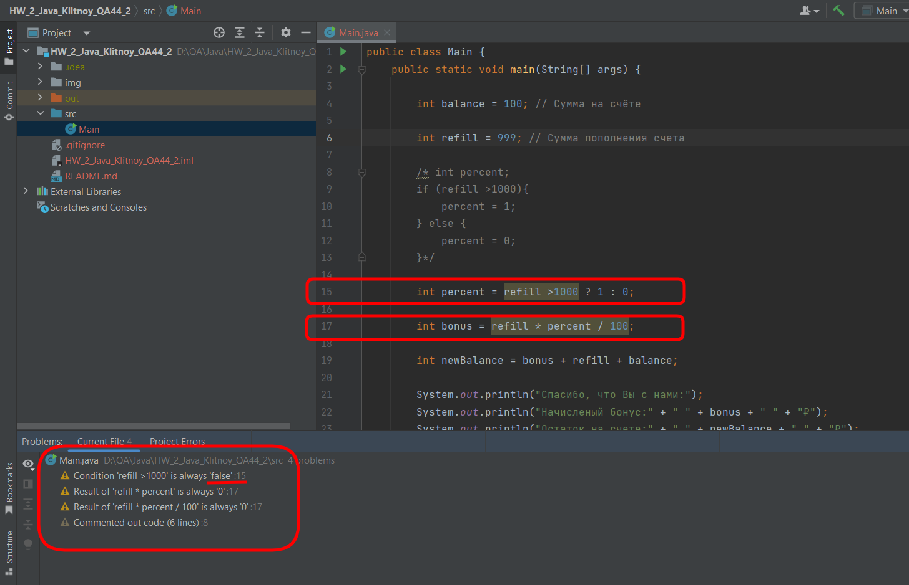

# ДЗ 2 Задание 2

Программа реализации акции **"Получи рубль за каждые 100!"**

## Комментарий к коду программы

Я написал в программе код решения и с помощью "условного оператора" и спомощью "тернарного условного оператора", первый я закомментировал.

## Вопросы

Java или IDEA, ругается на строчки 15 и 8 

### Вопрос 1

Подскажите пожалуйста, почему ему не нравится в строке 8 открытый тег закомментированния кода?

А со строкой 15 я выяснил история такая, если сумма пополнения больше 1000, то он ругается на 15 строку и пишет, что reliff всегда true:

А если сумма пополнения ментше 1000, то он ругается на 15 и на 17 строки, и пишет, что reliff всегда false, а в 17 - percent всегда 0

При этом программа работает согласно условиям акции

### Вопрос 2

Подскажите пожалуйста это нужно исправлять, или можно игнорировать? Или нужно принципиально по-другому писать код?
